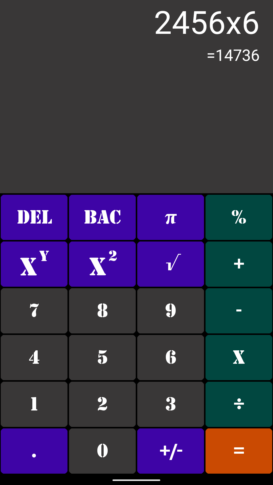
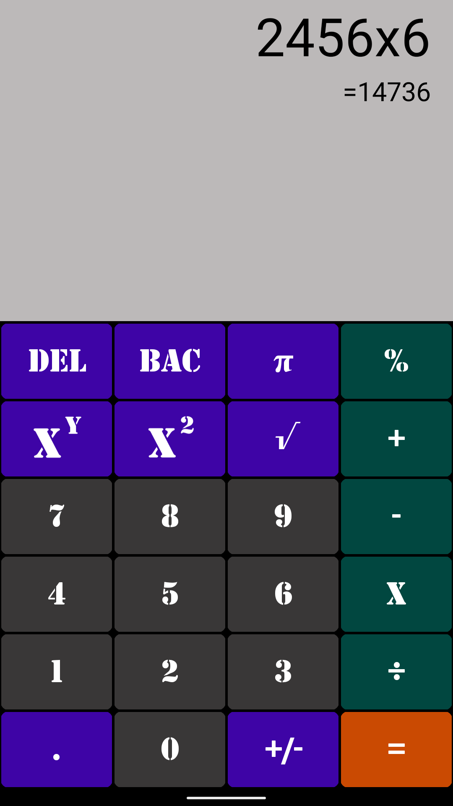
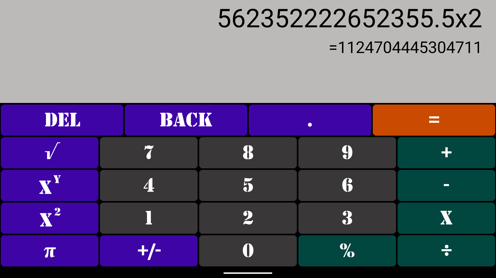
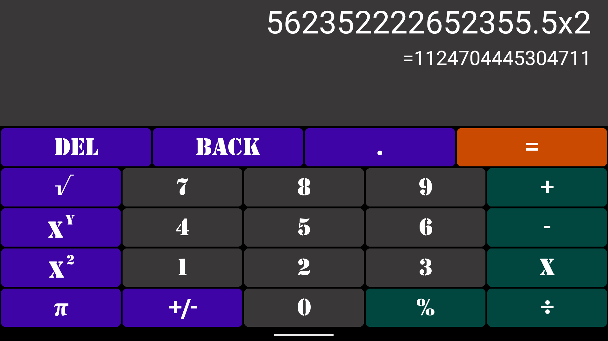

# Simple Calculator v2
# [MIT License](LICENSE)

> [!IMPORTANT]
> Use of .xml vector path, .svg, .png and .bmp files, as well as all brand logos, is excluded from this license. Any use of these file types or logos requires prior permission from the respective owner or copyright holder.

### Mobile application for Android OS written in Java and available to download from Play store

Features: Calculator, Fast calc method, Beautiful design, Working interface, Copy/Share functionality, Display mode: portrait/landscape

Resolution: MDPI, HDPI, XHDPI, XXHDPI, XXXHDPI, DayNight mode

<a href="https://play.google.com/store/apps/details?id=com.martinatanasov.simplecalculatorv2">Simple calculator link</a>

## Images

<table>
    <tr>
        <td></td>
    </tr>
    <tr>
        <td></td>
    </tr>
    <tr>
        <td></td>
    </tr>    
    <tr>
        <td></td>
    </tr>
</table>

